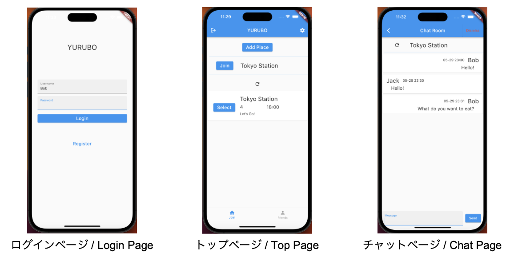

# YURUBO

若者の交流促進！ご飯に行きたい人同士のリアルタイム募集システム -

The real-time matching system between people who want to go out to eat. 
We try to solve the issue of 'eating alone' among young people.

## 目的／Object
今からご飯に出かけたい人のニーズをマッチさせる。

YURUBO supports people looking for others who want to go out for eating "just now".

## デモ画像／Demo Image
YURUBOの参考画像

- 既に登録している友達が作ったグループに参加したり、自分で募集をかけたりして、気軽に一緒に食べに行く人を見つけられる！

- You can easily find people to go out to eat with by joining groups created by your already registered friends or by recruiting people by yourself!

## ターゲットユーザ／Main target user
１人暮らしの学生

Students who live alone

## 社会的意義／Social significance

- 若者同士の交流の促進
- 若者の「孤食（個食）」の解消

- YURUBO promotes interaction between younger.
- Decline to eat alone among younger.

## 新規性と優位性／Novelty and Superiority
- リアルタイムでご飯を食べに行きたい人同士のニーズに着目している。
- チャット機能があることで、アプリ内で全てのやりとりを完結できる。

- YURUBO focuses on the social needs of those who want to eat out in real-time.
- Chat function enables us to complete of all operation within the app.

## 開発環境／DEV
- プラットフォーム：Flutter
- データベース：Supabase
